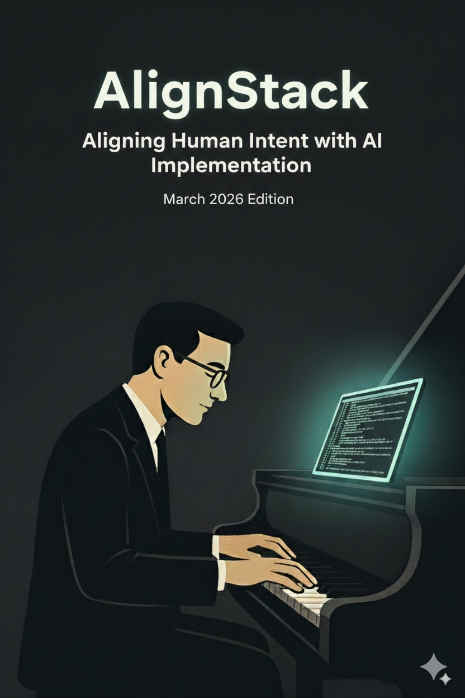

# AlignStack: Aligning Human Intent with AI Implementation

  

## Welcome

Welcome to the comprehensive guide on AlignStack. This methodology transforms the intuitive art of vibe coding into a structured approach with repeatable patterns for AI collaboration. It bridges the gap between coding by feel and engineering discipline. The core philosophy of this book can be summarized in this way:

When you delegate work to AI, failure can happen at 6 different alignment layers:

1. **Workspace Alignment** — The environment and context aren't set up correctly
2. **Task Alignment** — The task is not understood well
3. **Action-Space Alignment** — AI doesn't know what action space should be used
4. **Action-Set Alignment** — AI doesn't understand what set of actions is preferable and feasible
5. **Coherence Alignment** — AI doesn't understand how the actions taken disturb existing alignments
6. **Outcome Alignment** — AI doesn't understand how actions taken and expected results are in mismatch

Therefore, with the AlignStack Methodology we identified patterns (mostly for AI-assisted SWE practice) which allow us to maintain alignment on these 6 different levels.

Unlike pure vibe coding, AlignStack offers systematic, repeatable foundations and fine-grained control at every stage of development.

This book doesn't introduce new concepts. Instead, it codifies what many developers already do instinctively, turning scattered practices into a cohesive methodology.

### Core Principles
Alignment requires comparasion. 
Comparasion requires measurement.
Measurement requires visibility (in terms of intent). 
Visibility requires ...

AlignStack operates on four pillars of explicitness:

- **Radical Transparency**: Make everything visible - tests, data flows, transformations
- **Verbose Communication**: Chatty tests that explain what's happening
- **Explicit Over Implicit**: No hidden behaviors or assumptions
- **Human-in-the-Loop**: Maintain control while leveraging AI power

## Why AlignStack?

As software developers, we navigate real requirements, team dynamics, and technical constraints while balancing timelines, quality standards, and accountability.

And recently we face immense pressure in our craft to harness the power of AI-assisted coding. Yet many treat AI as just a syntax generator, missing out on 10x productivity gains. Others hand over control entirely, inheriting brittle code and hidden vulnerabilities.

AlignStack bridges this gap. An evolving framework for true developer-AI partnership without the compromises.
   

## What You'll Learn

This book provides both philosophical foundation and practical implementation:

- **Part I**: Foundations - History, philosophy, and core concepts
- **Part II**: Understanding AI Collaboration - How AI thinks about code and effective collaboration
- **Part III**: AlignStack Patterns - Essential patterns like DevDocs, Anchor, Probe Tests, and Fuzzy Architecture
- **Part IV**: The AlignStack Method - Step-by-step implementation guide
- **Appendices**: Ready-to-use prompts and templates

## Quick Start

If you prefer learning by doing:
1. Jump to [Appendix 1: New Project Prompts](APPENDIX1_NEW_PROJECT_PROMPTS.md) for step-by-step implementation
2. Use [Appendix 2: From Existing Codebase Prompts](APPENDIX2_FROM_EXISTING_CODEBASE_PROMPTS.md) to apply AlignStack to existing projects

## Who Should Read This

This book is for you if you've ever:
- Watched AI generate code that looked perfect but didn't work
- Spent hours debugging despite all tests passing
- Felt disconnected from a "clean" and "well-tested" codebase
- Wondered why simple changes break in unexpected ways

## How to Navigate

- **New to AlignStack?** Start with the [Preface](preface.md) and follow the chapters sequentially
- **Experienced Developer?** Chapters 0-4 provide a 15-minute introduction to essential concepts
- **Ready to Implement?** Jump directly to the appendices for practical prompts

## Join our communities for more tips interesting discussions

[Linkedin AlignStack Community](https://www.linkedin.com/groups/15074007/)

